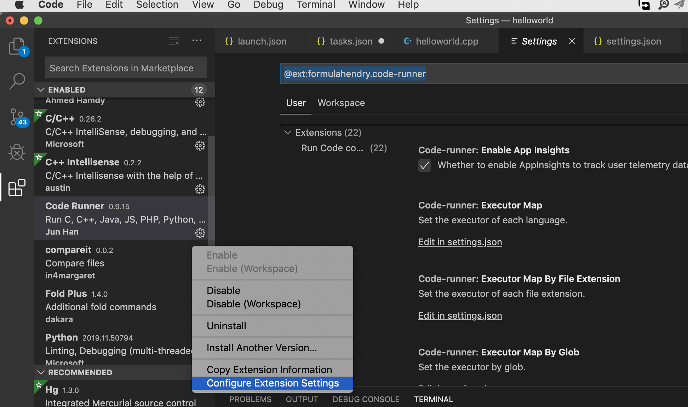

# 在MAC上使用VSCode运行调试简单c/c++程序

[toc]

##1.下载安装

进入官网(https://code.visualstudio.com/ )正常点击下载就好

## 2.将VS Code添加到系统`PATH`

添加到PATH的好处是可以通过命令行直接在当前目录创建工程目录并在当前目录打开VSCode图形化界面

1. 打开`VS Code`

2. 按住`⇧⌘P` 或者选择系统顶部菜单栏 `View` -> `Command pattle`(第一个选项)

3. 输入`shell`，选择第一个选项即可

   

这样就添加好了

##3. 使用命令行创建工程，打开VS Code

如下图创建helloworld工程并打开vscode


## 4.配置编译器路径

1. 按住`⇧⌘P` 输入 `c/c++`, 选择**Edit Configurations (UI)**

2. 把 **IntelliSense mode** 改成 `${default}`, （原来是 `clang-x64`）.

   

## 5. 创建一个build 任务

1.打开命令行菜单（`⇧⌘P`），输入`task`, 选择**Configure Default Build Task**. 接着选择 **Create tasks.json file from template**, 然后是 **Others**. 


2.直接用下面的代码替换掉出现的文件

```json
{
  "version": "2.0.0",
  "tasks": [
    {
      "label": "Build with Clang",
      "type": "shell",
      "command": "clang++",
      "args": [
        "-std=c++17",
        "-stdlib=libc++",
        "helloworld.cpp",
        "-o",
        "helloworld.out",
        "--debug"
      ],
      "group": {
        "kind": "build",
        "isDefault": true
      }
    }
  ]
}
```


## 6.debug设置

1. 打开命令行菜单输入`lauch` 选择**GDB/LLDB**

2. 替换代码，cmd+s保存下

```json
{
  "version": "0.2.0",
  "configurations": [
    {
      "name": "(lldb) Launch",
      "type": "cppdbg",
      "request": "launch",
      "program": "${workspaceFolder}/helloworld.out",
      "args": [],
      "stopAtEntry": true,
      "cwd": "${workspaceFolder}",
      "environment": [],
      "externalConsole": true,
      "MIMode": "lldb",
      "logging": {
        "trace": true,
        "traceResponse": true,
        "engineLogging": true
      }
    }
  ]
}
```

这一步结束，可以注意工程目录文件到变化


## 7.添加代码文件

1.在主菜单中选择 **File > New File** 命名为 `helloworld.cpp`

2.粘贴代码，保存下

```c++
#include <iostream>
#include <vector>
#include <string>

using namespace std;

int main()
{

    vector<string> msg {"Hello", "C++", "World", "from", "VS Code!"};

    for (const string& word : msg)
    {
        cout << word << " ";
    }
    cout << endl;
    return 0;
}
```

##8.编译运行代码

在选中源代码文件的情况下按快捷键`⇧⌘B`


菜单中选择，或者 直接按F5


再按一次F5，继续运行，在新弹出的窗口中就可以看到运行结果了：


## 9.简单调试

1. 设置断点，行号前面鼠标单击下就行

   

2. 简单信息查看：

   

3. 可以在watch中右键添加关注的变量,也可以输入函数表达式

   

   

## 10.插件安装

下面这几个插件装好之后，写代码就能有提示补全之类的功能了，


`Code Runner`装好之后，就可以直接写代码单击右上角的三角形符号 

 编译运行了,但是 code Runner 编译选项不能配置，所以就不能使用c++17 了

但是普通的程序还是可以直接运行的：


运行结果：


codeRunner 要设置下集成到terminal中




## 注意点

mac 系统是 Mojave 10.14 之前用catalina10.15 打断点无法调试，各种google后来好像是bug不支持。。。

## 参考

> https://code.visualstudio.com/docs/cpp/config-clang-mac